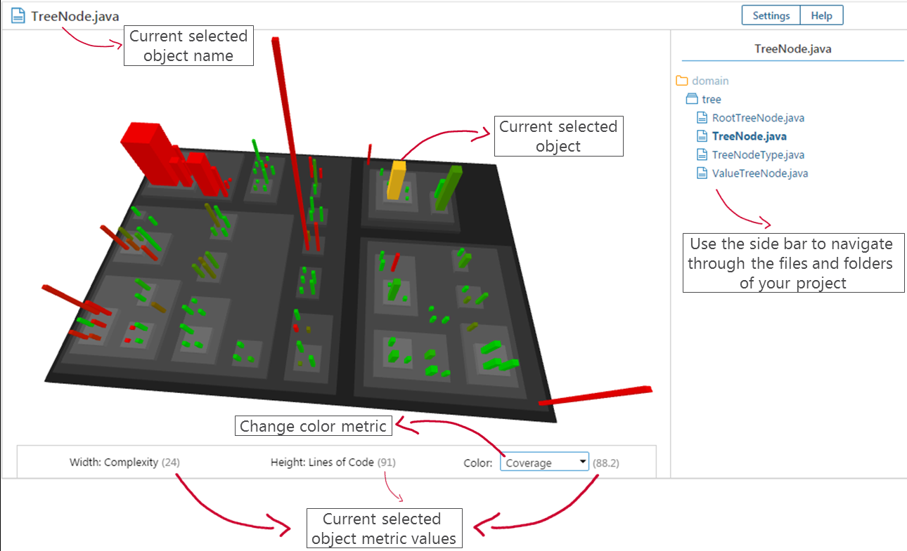

# Overview

Software systems are complex, intangible structures, which are hard to understand. Therefore, visualization of software properties, structure and dependencies in different views play an important role within the lifecycle of a software system. SoftVis3D is a tool for 3D visualization of software structures and metrics that can be integrated in the software development process by using SonarQube.

Give your software a shape, build from the sources of your project. Communicate about the structure by using the visualisation, from the developer up to management. You will see hot spots faster and more reliable than before.

#### Benefits

- Benefits
- Code city view of your project
- Any metric from SonarSource can be used
- Easily navigate through the 3D visualisation
- WebGL technology to support all browsers
- Helps you analyze your software quality easily

#### Getting started

If you are running SonarQube >= 5.5 go to 'Administration -> System -> Update center' and install with a single click!

Or you can download it here. (TODO link)

#### 3D city layout

##### Code city

The "code city" view provides a visualization for the hierarchical structure of the project. Folders or packages are shown as districts, files as buildings. The building footprint, height and color are dependent on two arbitrary sonar metrics.

##### Evostreet

Evostreet is a stable layout for visualizing evolving software systems using the city metaphor.

### Live demo - Examples

You can take a look at the visualisation various open source projects on our SonarQube live demo instance which is available [here](https://softvis3d.com/sonar/){:target="_blank"}.

#### Jenkins server project

...

#### SonarQube github project

...

# Documentation

### Options

#### Profiles

Profiles give you a good head start to your project and select the most common metrics for the visualization.

##### Default risk profile
- Footprint metric: Complexity
- Building height metric: Lines of code
  
This profile provides a very good overview of the structure of your project. It should be easy to identify the classes 
or packages with the highest risks.

##### Leak period profile
- Footprint metric: Complexity
- Building height metric: **New** lines of code

Check the quality of new code in the current leak period. It should be easy to identify the changing parts of the 
system (high buildings) and to identify the parts with the most risk. Take a closer look at the changing parts during 
the next release tests.

##### Duplicated lines profile
- Footprint metric: Complexity
- Building height metric: Duplicated lines of code

Buildings only gain height if duplicated code is found within the class or file. Search for hot spots of high buildings. 
High and massive buildings could contain complex duplicated code which is a high risk especially if a lot of changes 
take place.

##### Custom profile

Is set if you change one of the profile related metrics (footprint, height).

#### Building color

The building color will be orange if nothing is selected here. Other options:

- Complexity
- Coverage
- **Number of authors**

This rule has the "bus factor" in focus. Building is green from 4 committers and more.

